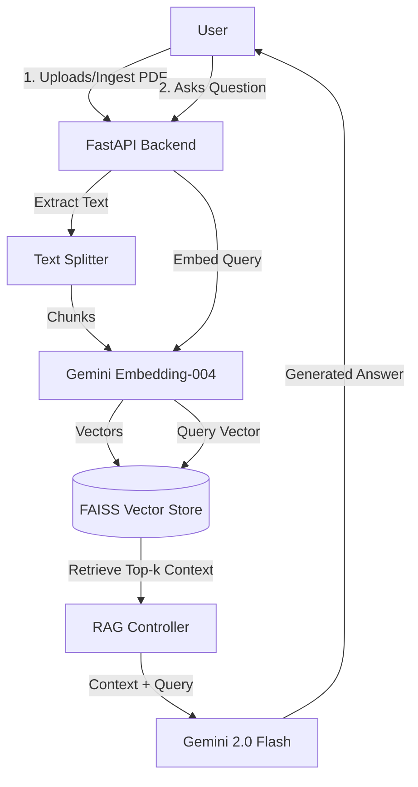

# RAG 2.0 - Intelligent Document Assistant

A powerful, full-stack Retrieval-Augmented Generation (RAG) application built with **FastAPI** and **React**. This project leverages **Google Gemini 2.0 Flash** for high-speed, accurate question answering and **Gemini Text Embedding 004** coupled with **FAISS** for efficient vector retrieval.

## 🌟 Features

- **Document Ingestion**: Upload and process PDF documents automatically.
- **Smart Chunking**: Intelligent text splitting optimized for context retrieval.
- **Vector Search**: High-performance similarity search using FAISS (Facebook AI Similarity Search).
- **Gemini Powered**: Uses the latest Google Gemini 2.0 Flash model for natural language generation.
- **Modern UI**: Clean, responsive React interface for seamless interaction.
- **Extensible Architecture**: Modular backend design easy to adapt for other models.

## 🏗️ Architecture



## 🛠️ Tech Stack

### Backend
- **Framework**: FastAPI (Python 3.10+)
- **LLM**: Google Gemini 2.0 Flash
- **Embeddings**: Google Gemini Text Embedding 004
- **Vector Database**: FAISS (CPU)
- **PDF Processing**: pypdf
- **Orchestration**: LangChain Text Splitters

### Frontend
- **Framework**: React (Vite)
- **Styling**: CSS Modules / Vanilla CSS

## 📋 Prerequisites

Before running the project, ensure you have the following installed:
- **Python** 3.10 or higher
- **Node.js** 18 or higher
- **Google Cloud API Key** with access to Gemini API

## 🚀 Getting Started

Follow these steps to set up the project locally.

### 1. clone the repository
```bash
git clone <repository-url>
cd rag-2.0
```

### 2. Backend Setup
Navigate to the backend directory and set up the environment.

```bash
cd backend
python -m venv .venv
# Activate Virtual Environment
# Windows:
.venv\Scripts\activate
# Mac/Linux:
source .venv/bin/activate

# Install Dependencies
pip install -r requirements.txt
```

**Configuration**:
Create a `.env` file in the `backend` folder and add your API key:
```env
GEMINI_API_KEY=your_actual_api_key_here
```

start the server:
```bash
uvicorn main:app --reload --host 0.0.0.0 --port 8000
```
The backend will be available at `http://localhost:8000`.

### 3. Frontend Setup
Open a new terminal window and navigate to the frontend directory.

```bash
cd frontend
npm install
npm run dev
```
The frontend will be available at `http://localhost:5173`.

## 📚 Usage Guide

### Generating Sample Data
If you don't have a PDF to test with, you can generate a sample insurance FAQ document:
```bash
# From the project root
python generate_sample_data.py
```
This creates `backend/data/Insurance_FAQ.pdf`.

### Ingesting Data
Before you can chat, the system needs to "read" and index the document.
Run this command (or use Postman/Curl):

**PowerShell**:
```powershell
Invoke-RestMethod -Method Post -Uri "http://localhost:8000/ingest"
```

**Curl**:
```bash
curl -X POST http://localhost:8000/ingest
```

### Chatting
1. Open the frontend (`http://localhost:5173`).
2. Click the chat bubble icon.
3. Ask questions like:
   - "How do I file a claim?"
   - "What is the deductible?"

## 📁 Project Structure

```
RAG 2.0/
├── backend/
│   ├── data/                 # Storage for PDFs and FAISS indices
│   ├── main.py               # FastAPI entry point
│   ├── rag.py                # Core RAG logic (Retrieval + Generation)
│   ├── embedding_utils.py    # Gemini Embedding wrapper
│   ├── faiss_utils.py        # Vector store management
│   └── requirements.txt      # Python dependencies
├── frontend/
│   ├── src/
│   │   ├── App.jsx           # Main React component
│   │   └── App.css           # Styles
│   └── package.json          # Node dependencies
├── generate_sample_data.py   # Utility to create dummy PDF
└── README.md                 # Project documentation
```

## 🤝 Contributing

Contributions are welcome! Please fork the repository and submit a pull request.


